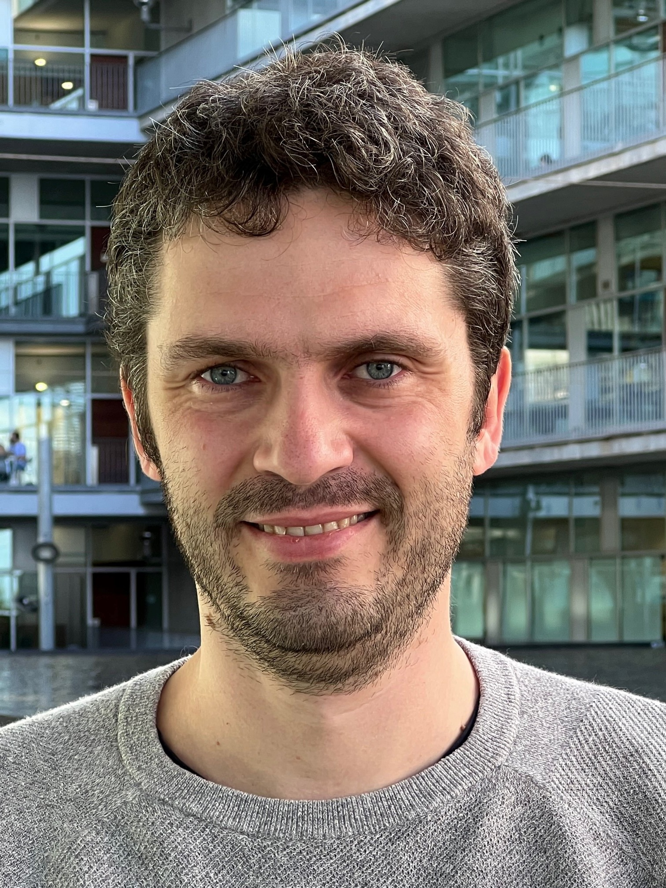

::: {.hero}
::: {.hero-text}
# Philippe Mortier, MD, MSc, PhD

**Psychiatrist · Principal Researcher**  
[Hospital del Mar Research Institute](https://researchmar.net/)  
Barcelona, Spain

## Developing data-driven approaches to improve suicide prevention and mental healthcare.

[Research](#research){.btn .btn-primary} [Publications](#publications){.btn .btn-outline-primary} [Contact](#contact){.btn .btn-outline-primary}
:::

::: {.hero-photo}
{fig-alt="Portrait of Philippe Mortier"}
:::
:::

::: {.section}
## About

I am a psychiatrist and principal researcher at the [Hospital del Mar Research Institute](https://researchmar.net/) in Barcelona, Spain. My research lies at the intersection of clinical epidemiology and translational psychiatry, with the overarching goal of improving the prevention and care of suicidal thoughts and behaviours.

My work combines large-scale healthcare data, clinical expertise, and advanced analytical methods to better understand why suicidal thoughts and self-harm develop, how they evolve over time, and how healthcare systems can identify and support people at risk more effectively. A major focus of my current research is the development of clinical tools that help healthcare professionals deliver more timely, personalized, and evidence-based care.

This includes close collaboration with healthcare professionals and the meaningful involvement of people with lived experience throughout the research process.

I also lead research on the early development of suicidal thoughts, examining how stress sensitivity and daily-life experiences contribute to suicidal ideation onset in young people using ecological momentary assessment. In addition, I collaborate internationally within the International College Student initiative to better understand why some individuals progress from suicidal thoughts to suicide plans and attempts.

My research is closely embedded within the clinical infrastructure of Parc de Salut Mar, an integrated academic healthcare organization serving more than 300,000 people in Barcelona. This close connection between research and clinical practice provides a unique opportunity to translate scientific discoveries into tangible improvements in suicide prevention and mental healthcare.

I welcome opportunities for collaboration with researchers, clinicians, healthcare organizations, and people with lived experience who share the goal of advancing suicide prevention through science and innovation.
:::

::: {.section #research}
## Current Research

::: {.cards}
::: {.card}
### Artificial Intelligence for Suicide Prevention
Developing prediction models and clinical decision support tools for routine mental healthcare.
:::

::: {.card}
### Clinical Epidemiology
Using linked healthcare registry data to understand suicidal thoughts, self-harm, and suicide.
:::

::: {.card}
### Digital Mental Health
Studying suicidal ideation and stress sensitivity in daily life using ecological momentary assessment.
:::

::: {.card}
### Global Mental Health
Understanding suicidal thoughts and behaviours among university students through international collaborations.
:::
:::
:::

::: {.section}
## Featured Project

### PERMANENS

PERMANENS is a European project developing AI-supported clinical decision support systems for suicide prevention.

[Project website](https://permanens.eu/){.btn .btn-outline-primary} [Training platform](https://aid.permanens.eu/){.btn .btn-outline-primary}
:::

::: {.section #publications}
## Selected Publications

::: {.publication}
### Individual- and population-level associations of mental disorders with intentional self-harm
*European Psychiatry*, 2026  
[PubMed](https://pubmed.ncbi.nlm.nih.gov/41804262/)
:::

::: {.publication}
### Subtypes of suicidal ideation among university students – An ecological momentary assessment study
*Journal of Affective Disorders*, 2025  
[PubMed](https://pubmed.ncbi.nlm.nih.gov/40652971/)
:::

::: {.publication}
### Trends of non-lethal intentional self-harm and suicide in Spain 2018–2023
*The Lancet Regional Health – Europe*, 2025  
[PubMed](https://pubmed.ncbi.nlm.nih.gov/41080066/)
:::

::: {.publication}
### Predicting Intentional Self-Harm Following Psychiatric Discharge in Catalonia, Spain
*medRxiv*, 2025  
[Preprint](https://www.medrxiv.org/content/10.1101/2025.09.26.25336360v1)
:::

::: {.publication}
### Premature Death, Suicide, and Nonlethal Intentional Self-Harm After Psychiatric Discharge
*JAMA Network Open*, 2024  
[Article](https://doi.org/10.1001/jamanetworkopen.2024.17131)
:::
:::

::: {.section #contact}
## Contact

**Email:** [pmortier@researchmar.net](mailto:pmortier@researchmar.net)  
**LinkedIn:** [Philippe Mortier](https://www.linkedin.com/in/philippe-mortier-b866b690/)  
**Google Scholar:** [Profile](https://scholar.google.com/citations?user=3MDLofYAAAAJ)
:::
